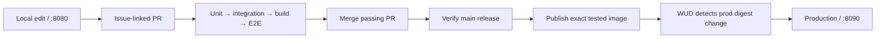

# CI/CD calculator demo

A small FastAPI calculator that makes the path from a local edit to a tested production release visible. One HTML file calculates in JavaScript, verifies through Python, and shows whether the results agree.

**Implemented and rehearsed:** unit/integration/browser tests, Docker Hub publication, WUD automatic deployment, three deliberate test failures, and rollback/resume. See the [evidence record](docs/evidence.md) for actual runs, commits, digests, and timings.

## Run the demo

Prerequisites: Docker Desktop with ARM64 Linux containers, Git, `make`, and a bootstrap `python3` with pip. Python 3.13.15 and uv 0.12.15 install locally inside ignored `.tools/`; no global Python replacement is required. This initial image targets **linux/arm64**, matching the verified Mac and GitHub runner.

```sh
git clone git@github.com:kaw393939/is373_ci_cd.git
cd is373_ci_cd
make setup
make browsers
make up
```

`make up` builds the source-mounted development container, pulls the published production image, and starts WUD. You can use `make dev` before the first image is published in a new fork.

| Service | Default address | Behavior |
| --- | --- | --- |
| Development | [localhost:8080](http://localhost:8080) | Mounted local source with reload |
| Production | [localhost:8090](http://localhost:8090) | Last passing image from Docker Hub |
| WUD dashboard | [localhost:8091](http://localhost:8091) | Authenticated image monitoring and updates |

WUD login: username `admin`; open local `.state/wud.env` for the generated password. That file is ignored and restricted to its owner. Use `make check-updates` to request a registry check without opening the dashboard.

The local port conflict is resolved: development runs on `8080`. The previous Apache container was stopped with the owner's permission and retained intact ([#19](https://github.com/kaw393939/is373_ci_cd/issues/19)). For a different machine with an occupied port, copy `.env.example` to ignored `.env` and set `DEV_PORT`.

## Test and operate

```sh
make test-unit          # Pure Python arithmetic and release guards
make test-integration   # Real FastAPI request/response contracts
make build             # Build the release image once
make test-e2e          # Chromium against that image on isolated port 18090
make status            # Running services and production release
make check-updates     # Ask WUD to check the registry now
make down              # Stop this project's services; keep WUD data
```

Failed browser tests retain traces/screenshots under `artifacts/playwright`; CI uploads them for seven days. Local `make test-e2e` removes its temporary container even on failure. The release image has no browser or test packages.

For rollback and resumption, use the [demo runbook](docs/demo.md). The Make commands preserve local rollback state; bare `docker compose up` does not read that state automatically.

## Delivery flow



Only a passing `main` push publishes. PRs and manual verification never publish. Each release receives a `sha-<full-commit>` tag and the mutable `prod` channel. Production health and the page footer identify what actually deployed; a green publishing run alone is not deployment evidence.

Observed examples: first verification 58 seconds, first publication job 90 seconds, cached publication job 56 seconds, automatic update about 39 seconds after publication. These are recorded observations, not timing guarantees.

## Specifications and development

- [Product specification](docs/spec.md): numbered requirements and HTTP contract.
- [Architecture](docs/architecture.md): components, runtime decisions, and adaptation.
- [Testing strategy](docs/testing.md): the three boundaries and failure evidence.
- [CI/CD specification](docs/ci-cd.md): gates, versioning, publication, and rollback.
- [Implementation plan](docs/implementation-plan.md): issue history and dependencies.
- [Demo runbook](docs/demo.md), [evidence](docs/evidence.md), and [final QA report](docs/qa.md).
- [Contributing](CONTRIBUTING.md), [AI instructions](AGENTS.md), and [GitHub policy](docs/github-workflow.md).

[Issues](https://github.com/kaw393939/is373_ci_cd/issues) · [Milestone](https://github.com/kaw393939/is373_ci_cd/milestone/1) · [Actions](https://github.com/kaw393939/is373_ci_cd/actions) · [Commit history](https://github.com/kaw393939/is373_ci_cd/commits/main/)
