# CI/CD calculator demo

A small calculator for learning how a change moves from local development through tests, a container registry, and automatic deployment.

**Status: specification and repository setup only.** The application, tests, Docker configuration, and GitHub Actions workflows are planned; they do not exist yet. The commands in the specifications describe the intended interface, not a working quick start.

## Start the review here

1. [Product specification](docs/spec.md) — calculator behavior and acceptance criteria.
2. [Architecture](docs/architecture.md) — components, environments, and open decisions.
3. [Testing strategy](docs/testing.md) — what unit, integration, and browser tests prove.
4. [CI/CD specification](docs/ci-cd.md) — publishing, deployment, failure handling, and rollback.
5. [Implementation plan](docs/implementation-plan.md) — ordered issues and completion criteria.
6. [Demo walkthrough](docs/demo.md) — the eventual classroom demonstration.

## Intended experience

Enter two numbers, select an operation, and click **Calculate**. The page calculates in JavaScript and requests the same calculation from FastAPI. It shows both results and whether they agree. A footer identifies the environment and deployed commit.

| Component | Choice |
| --- | --- |
| Backend | Python, FastAPI, Uvicorn |
| Frontend | One HTML file with inline CSS and JavaScript |
| Unit and integration tests | pytest and FastAPI TestClient |
| Browser tests | Playwright for Python, Chromium only |
| Image registry | `kaw393939/is373_ci_cd` on Docker Hub |
| Automation | GitHub Actions and What's Up Docker (WUD) |
| Local services | Development on `8080`, production on `8090` |

```mermaid
flowchart LR
    edit[Local edit] --> dev[Preview on :8080]
    dev --> git[Push branch / open PR]
    git --> checks[Unit + integration + build + E2E]
    checks --> merge[Merge to main]
    merge --> recheck[Test main and build release image]
    recheck --> hub[Publish passing image to Docker Hub]
    hub --> wud[WUD detects prod digest change]
    wud --> prod[Production on :8090]
```

Publication and deployment are distinct: a green publishing workflow proves the image was published, while the production health response and commit prove that it was deployed.

## Development workflow

Work from an issue with linked requirement IDs, make focused commits, and use a pull request with validation evidence. Read [CONTRIBUTING.md](CONTRIBUTING.md) for the human workflow and [AGENTS.md](AGENTS.md) for AI development instructions.

- [GitHub issues](https://github.com/kaw393939/is373_ci_cd/issues)
- [Project milestone](https://github.com/kaw393939/is373_ci_cd/milestones)
- [Commit history](https://github.com/kaw393939/is373_ci_cd/commits/main/)
- [GitHub configuration plan](docs/github-workflow.md)

The deployment host, its CPU architecture, and Docker Hub visibility still need confirmation. See [open decisions](docs/architecture.md#open-decisions). No database, account system, frontend build tool, or public hosting is required for version 1.
