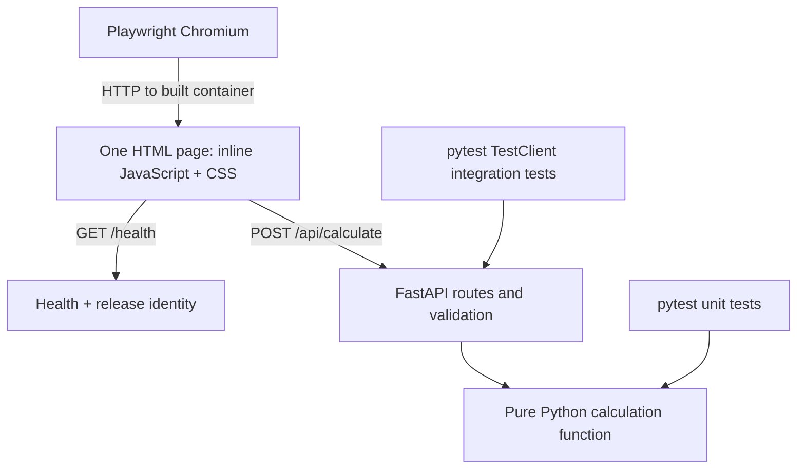

# Architecture and decisions

Status: implementation in progress. Environment facts below were inspected on 2026-09-17.

## Components



FastAPI serves the page and API from one origin, avoiding CORS configuration. Calculation logic has no dependency on HTTP, environment variables, or container runtime. The API layer translates validation and domain errors into the specified HTTP contract.

Use Uvicorn in both environments: reload for development; a single process without reload for production. Use a maintained Python slim base image and pin dependency versions during implementation. Keep pytest, HTTPX test tooling, and browser binaries out of the production image. Playwright runs in CI tooling against the application container.

## Intended repository layout

This is a target layout, not a listing of existing files:

```text
app/
  main.py                 # Routes, request schema, release metadata
  calculator.py           # Pure Python arithmetic and domain validation
  index.html              # All frontend markup, CSS, and JavaScript
tests/
  unit/
  integration/
  e2e/
  conftest.py
Dockerfile
compose.yaml
Makefile
pyproject.toml
<dependency lock file>    # Exact format chosen in implementation
.github/workflows/ci.yml
```

## Docker Compose services

| Service | Host mapping | Source of code | Lifecycle |
| --- | --- | --- | --- |
| `dev` | `127.0.0.1:8080` → container `8000` | Mounted local source | Uvicorn reload |
| `prod` | `127.0.0.1:8090` → container `8000` | Docker Hub image | Recreated after a passing release |
| `wud` | Optional `127.0.0.1:8091` dashboard | Pinned WUD image | Registry polling and production update |

Loopback binding is the proposed default for a local classroom demo. Remote/public access is an open decision, not implied by the name “production.” Production here means the release-built runtime. Map different host ports to the same internal application port.

One Compose file should support `make dev` before any production image exists, then `make up` once the first release is published. Development and production must not share a source-code volume. WUD needs Docker control access to recreate containers; mounting a Docker socket read-only does not make Docker API access read-only. Treat the updater as a privileged local component, keep its dashboard local, and do not expose the daemon over unauthenticated TCP.

WUD's update trigger and Compose path handling require an implementation spike: prove that it updates only `prod`, retains the desired Compose configuration, and leaves `dev` running. If the Compose trigger cannot provide this behavior, record the decision to use WUD's container trigger and verify Compose reconciliation before adopting it. Do not silently broaden the update scope.

## Decisions already made

| Decision | Reason |
| --- | --- |
| FastAPI and one HTML file | Small application with no frontend compile step |
| JavaScript and Python both calculate | Makes browser/API integration visible |
| One Calculate button | One short E2E interaction covers the complete flow |
| pytest at both lower test levels | Consistent runner and clear test directory separation |
| Playwright Python, Chromium only | Real browser coverage with a narrow dependency set |
| Docker Hub and WUD | Demonstrates registry publication and host-side automatic deployment |
| Commit-tagged images plus `:prod` | Traceable releases with a simple deployment channel |
| No database | Keeps tests deterministic and the lesson focused |

## Verified environment decisions

- Deployment uses this Mac's Docker Desktop on `linux/arm64`, with services bound to loopback.
- The GitHub repository and `kaw393939/is373_ci_cd` Docker Hub repository are public.
- CI will use `ubuntu-24.04-arm` and publish a single `linux/arm64` image. This avoids emulation and tests the deployment architecture directly. AMD64 support is a future adaptation.
- Python is `3.13.15`; uv `0.12.15` bootstraps locally under ignored `.tools/`, with the full dependency graph committed in `uv.lock`.
- Python container base: `python:3.13.15-slim-bookworm`, pinned by digest in the Dockerfile when implemented.
- WUD selected release: `9.0.2`, pinned by digest when implemented.
- Docker Hub push permission remains to be verified by the first successful Actions publication.
- Port `8080` is currently occupied by unrelated container `confident_mendel`; owner permission to stop it or use an alternate dev port is pending. No unrelated container has been changed.

## Open decisions

Resolve before the related implementation/deployment issue:

| Question | Proposed default | Why it matters |
| --- | --- | --- |
| Where will production and WUD run? | This Mac via Docker Desktop, alongside dev | Local-only versus remote networking and availability |
| What CPU architecture does that host use? | Inspect the actual host; do not assume | GitHub runner and deployment image must be compatible |
| Is the Docker Hub repository public? | Confirm with owner/registry | Private pulls require host and updater authentication |
| Does `DOCKER_API_KEY` permit pushes? | Verify during first publish without revealing the value | Secret existence alone does not prove permission |
| Which Python/package tool and WUD release? | Maintained versions pinned at implementation | Reproducibility and version-specific configuration |

For the shortest demo use a single deployment architecture and a compatible CI runner where practical. If that is unavailable, explicitly choose emulation or multi-platform builds and record the build-time tradeoff. Browser-test the deployable architecture, or state clearly when only one architecture of a multi-platform release was tested. Never silently ship an AMD64-only image to an ARM64 host.

## Adaptation to other frameworks

Keep the image publication, tags, registry credentials, WUD policy, issue workflow, and release verification pattern. Replace the application, dependency setup, Dockerfile, and implementations of the commands in [CONTRIBUTING.md](../CONTRIBUTING.md). Retain a health route and release identity so the deployment lesson still works.

## References

- [FastAPI container deployment](https://fastapi.tiangolo.com/deployment/docker/)
- [WUD Docker Compose trigger](https://getwud.app/docs/configuration/triggers/docker-compose/)
- [WUD watchers and digest monitoring](https://getwud.app/docs/configuration/watchers/)
